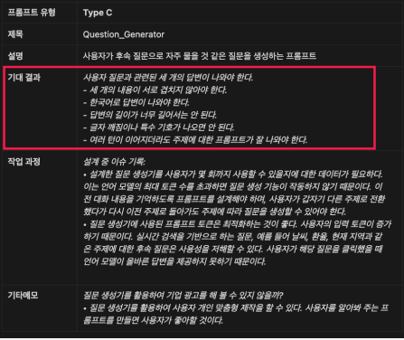

# 프롬프트 엔지니어링

이론 찍먹

## 프롬프트 엔지니어링이란?

- 언어모델(LM)을 효율적으로 활용하기 위해 프롬프트를 개발하고 최적화하는 비교적 새로운 분야임
- 다양한 애플리케이션과 연구 주제에서 LLM의 기능과 한계를 더 잘 이해할 수 있음
- 프롬프트 엔지니어링을 통해 LLM의 성능을 향상시키고, 안전성 및 도메인 확장성을 높일 수 있음
- 프롬프트 설계, 파라미터 조정, 외부 도구 연동 등 다양한 기법을 적용할 수 있음
- LLM과의 상호작용을 체계적으로 설계하여, 원하는 결과를 효과적으로 얻을 수 있음

#### 개발자가 프롬프트 엔지니어링을 배워야할 이유

- LLM(대규모 언어모델) 기반 서비스와 애플리케이션이 점점 많아지면서, 프롬프트 설계 능력이 실제 서비스 품질과 직결되기 때문임
- 효과적인 프롬프트 엔지니어링을 통해 모델의 성능을 극대화하고, 원하는 결과를 더 정확하게 얻을 수 있음
- 프롬프트 최적화로 비용을 절감하고, 다양한 도메인이나 요구사항에 맞는 맞춤형 솔루션을 개발할 수 있음
- LLM의 한계와 특성을 이해함으로써, 예측 불가능한 결과나 오류를 줄이고, 더 신뢰성 있는 시스템을 구축할 수 있음
- 최신 AI 트렌드와 기술 변화에 빠르게 대응하며, 경쟁력 있는 개발자로 성장할 수 있음

## LLM 설정

#### temperature

- 모델이 다음 토큰을 선택할 때 무작위성(창의성)을 조절하는 값
- 값이 낮을수록 더 일관되고 결정론적인 결과를 생성함
- 값이 높을수록 더 창의적이고 다양한 결과를 생성할 수 있음

#### top_p

- 확률이 높은 토큰들 중에서만 다음 토큰을 선택하도록 제한하는 값
- 낮게 설정하면 더 보수적이고 일관된 결과를 얻을 수 있음
- 높게 설정하면 더 다양한 결과를 생성할 수 있음

#### max length

- 모델이 생성할 수 있는 최대 토큰(단어) 수를 제한하는 값
- 응답이 너무 길거나 불필요하게 늘어나는 것을 방지함
- 결과의 길이와 비용을 효과적으로 관리할 수 있음

#### stop sequence

- 특정 문자열이 생성되면 응답 생성을 중단시키는 설정
- 리스트나 대화 등에서 원하는 지점에서 출력을 멈추게 할 수 있음
- 결과의 구조와 형식을 일관되게 유지할 수 있음

#### frequency penalty

- 이미 등장한 단어가 반복될 확률을 낮추는 패널티 값
- 값이 높을수록 같은 단어의 반복이 줄어듦
- 더 다양한 표현과 어휘 사용을 유도할 수 있음

#### presence penalty

- 등장한 모든 단어에 동일한 패널티를 적용하는 값
- 구문이나 단어의 반복을 줄이고, 새로운 단어 사용을 촉진함
- 창의적이거나 다양한 텍스트가 필요한 경우에 효과적임

## 프롬프팅 기법 - 기초

### Zero-shot Prompting

- 예시 없이 직접적으로 작업을 지시하는 가장 기본적인 프롬프팅 방식
- 간단하고 직관적이지만, 복잡한 작업에서는 정확도가 떨어질 수 있음
- "이 문장의 감정을 분석해줘" 처럼 직접적인 지시를 하는 방식

### Few-shot Prompting

- 몇 가지 예시를 제공한 후 작업을 수행하도록 하는 방식
- 모델에게 원하는 출력 형식과 패턴을 보여줄 수 있음
- 특히 특정 형식이나 스타일이 필요한 작업에서 효과적

```
# Zero-shot prompting
Q: 이 그룹의 홀수를 더하면 짝수가 된다.
15, 32, 5, 13, 82, 7, 1.
A: 네, 이 그룹의 홀수들을 더하면 107이 되는데,
이는 짝수입니다

# Few-shot prompting
이 그룹의 홀수들을 더하면 짝수가 됩니다 4, 8, 9, 15, 12, 2, 1.
답 거짓입니다.
이 그룹의 홀수들을 더하면 짝수가 됩니다 17, 10, 19, 4, 8, 12, 24.
답 참입니다.
이 그룹의 홀수들을 더하면 짝수가 됩니다 16, 11, 14, 4, 8, 13, 24.
답 참입니다.
이 그룹의 홀수들을 더하면 짝수가 됩니다 17, 9, 10, 12, 13, 4, 2.
답 거짓입니다.
이 그룹의 홀수들을 더하면 짝수가 됩니다 15, 32, 5, 13, 82, 7, 1.
답
A 정답입니다.
```


- Gold labels: 정답 라벨이 있는 예시를 사용한 경우 모델 성능이 가장 높음
- Random labels: 랜덤 라벨이 있는 예시를 사용해도 예시가 없는 경우보다는 성능이 좋음
- No input label format: 입력 라벨 형식을 유지하지 않은 경우 성능이 크게 저하

### Chain-of-Thought Prompting

- 모델이 단계별로 추론 과정을 보여주며 문제를 해결하도록 하는 기법
- 복잡한 수학 문제나 논리적 추론이 필요한 작업에서 특히 유용
- "천천히 단계별로 생각해보자" 같은 방식으로 유도

```
# 기본 프롬프팅

입력

    Q Roger는 테니스공 5개를 가지고 있습니다. 그는 테니스공 3개가 들어있는
    캔을 2개 더 삽니다. Roger는 이제 테니스공을 몇 개 가지고 있습니까?
    A 정답은 11입니다.
    Q 카페테리아에 사과가 23개 있었습니다. 그들은 20개를 점심을
    만드는 데 사용했고 6개를 더 샀습니다. 이제 사과가 몇 개 있습니까?

결과

    정답은 27입니다.

# Chain-of-Thought 프롬프팅

입력

    Q Roger는 테니스공 5개를 가지고 있습니다. 그는 테니스공 3개가 들어있는 캔을 2개
    더 삽니다. Roger는 이제 테니스공을 몇 개 가지고 있습니까?
    A Roger는 5개의 공으로 시작했습니다. 테니스공 3개가 들어있는 캔 2개를 더 샀습니다.
    5 6 11개. 정답은 11입니다.
    Q 카페테리아에 사과가 23개 있었습니다. 그들은 20개를 점심을 만드는 데 사용했고
    6개를 더 샀습니다. 이제 사과가 몇 개 있습니까?

결과
    카페테리아에 원래 사과가 23개 있었습니다. 그들은 20개를 점심을 만드는 데
    사용했습니다. 그래서 23 20 3개가 남았습니다. 그들은 6개를 더 샀기 때문에,
    이제 3 6 9개가 있습니다. 정답은 9입니다.

```

- 수학 문제를 푸는데 다른 기법보다 더 높은 성능을 보임


- CoT는 모델의 파라미터가 클 때 효과적


- 한계
  - 모델의 파라미터 수가 적은 모델에서는 기법의 성능이 떨어짐
  - 사람이 직접 사고의 과정을 문장으로 작성해야 하는 번거로움
  - 프롬프트의 완성도가 높지 않으면 결과가 좋지 않음

### Zero Shot Chain of Thought

- 별도의 예시 없이, "단계별로 생각해보자"와 같은 지시만으로 모델이 추론 과정을 스스로 생성하도록 유도하는 기법
- 복잡한 문제에 대해 명시적으로 사고의 단계를 요청함으로써, 모델이 중간 추론 과정을 거쳐 더 정확한 답변을 생성할 수 있도록 함
- 추가적인 예시(few-shot) 없이도, Chain-of-Thought 프롬프팅의 효과를 얻을 수 있어 프롬프트 설계가 간단해짐

```
Q Roger는 테니스공 5개를 가지고 있습니다. 그는 테니스공 3개가 들어있는 캔을 2개 더 삽니다. Roger는 이제 테니스공을 몇 개 가지고 있습니까?
"단계별로 생각해봐"
```


- trigger example
  

### Self-Consistency

- Chain-of-Thought의 확장된 버전으로, 여러 추론 경로를 생성하고 비교
- 다양한 접근 방식을 통해 더 신뢰할 수 있는 답변을 도출
- 여러 경로 중 가장 일관된 답변을 선택하는 방식

- Self-Consistency의 추론과정

  1.  CoT를 통한 문제 제시
  2.  여러 가지 경로로 답변을 샘플링
  3.  답변들을 종합하여 가장 많이 생성된 답변을 결과로 지정

  

- Greedy decode: 단일 경로를 따라 답을 생성
- Weighted avg unnormalized: 가중 평균을 사용하여 답을 도출
- Weighted sum normalized: 정규화된 가중 합을 사용하여 답을 도출
- weighted sum majority vote: 다수결 투표 방식

- 한계
  - 복잡한 추론 작업을 해결 할 때 비용이 많이 듦
  - 상당향 양의 훈련 데이터 필요, 모델이 일관된 응답을 효과적으로 생성하기 위해 다양한 추론 패턴을 학습해야 함

## 프롬프팅 기법 - 심화

여기서부터는 대부분 코딩을 해서 프롬프팅 성능을 개선하는 방법

### Generate Knowledge Prompting

- 모델이 작업 수행에 필요한 관련 지식을 먼저 생성하도록 하는 기법
- 더 정확하고 근거 있는 응답을 생성하는 데 도움
- 특히 전문적인 도메인의 질문에 답할 때 유용

  

- 작동 방식
  1.  지식생성: Few shot prompting을 사용해 언어 모델로부터 관련 정보 생성
  2.  지식통합: 1단계 생성된 정보에 대해 답변을 예측하고, 가장 높은 확신을 가진 예측을 최종 답변으로 선택
  3.  답변생성

```
# 지식생성
  Q: Why do people put ice cubes in drinks?
  A: To make them cold.

  Knowledge:
  - Ice cubes are frozen water that have a lower temperature than liquid water.
  - When ice cubes art put in drinks, they transfer some of their thermal energy to the drinks and melt into water.
  - As a result, the drinks become colder and more refreshing.
```

```
# 생성된 지식과 함께 질문을 입력하여 답변을 선택
  A1: To make them cold by transferring thermal energy from ice cubes to drinks. (Correct)
  A2: To make them sweet by adding sugar from ice cubes to drinks. (Incorrect)
  A3: To make them fizzy by creating bubbles from ice cubes to drinks. (Incorrect)

```

- 연구에 의하면 지식은 최대 20개 정도까지만 생성해도 된다고함
  

### Tree of Thoughts

- 문제 해결을 위해 여러 가지 사고 경로를 트리 구조로 탐색
- 각 단계에서 여러 가능성을 고려하고 최적의 경로를 선택
- 복잡한 의사결정이 필요한 문제에 특히 효과적

    

  ```
  이 질문에 답하는 데 적합한 세 명의 다른 전문가를 식별하고 그들처럼 행동하세요. 모든
  전문가는 단계와 해당 단계에 대한 생각을 작성한 후 그룹과 공유합니다. 그런 다음 모든
  전문가는 다음 단계로 진행합니다. 각 단계에서 모든 전문가는 동료의 응답을 1에서 5까지
  점수로 평가합니다. 1은 가능성이 매우 낮음을 의미하고, 5는 가능성이 매우 높음을
  의미합니다. 어떤 전문가가 어느 시점에서 틀렸다고 판단되면, 그들은 떠나게 됩니다.
  모든 전문가가 분석을 제공한 후, 세 가지 분석을 모두 분석하고 합의된 솔루션이나 최선의
  추정 솔루션을 제공합니다. 질문은...
  ```

### 그외

- Prompt chaining
- RAG
- Automatic Prompt Engineer
- Active-Prompt
- ReAct

## 프롬프팅 문서화

프롬프팅 문서화는 프롬프트의 설계, 사용, 개선 과정을 체계적으로 기록하는 작업입니다. 이를 통해 일관성, 재현성, 협업 효율을 높이고, 문제 발생 시 빠른 개선이 가능합니다. 문서화 시에는 구체성, 최신성, 보안, 표준화에 특히 유의해야 합니다.

### 필요성

#### 일관성 유지

여러 명이 프롬프트를 설계하거나 수정할 때, 문서화가 되어 있으면 동일한 기준과 스타일을 유지할 수 있습니다.

#### 재현성 확보

프롬프트의 설계 의도, 파라미터, 예시 등을 기록해두면, 동일한 결과를 반복적으로 얻을 수 있습니다.

#### 협업 및 공유

팀원 간에 프롬프트를 공유하거나, 다른 프로젝트에 재사용할 때 문서화된 자료가 큰 도움이 됩니다.

#### 문제 해결 및 개선

프롬프트의 변경 이력과 실험 결과를 기록하면, 성능 저하나 오류 발생 시 원인을 빠르게 파악하고 개선할 수 있습니다.

### 방법

#### 프롬프트 내용 기록

실제로 사용한 프롬프트(질문, 예시, 지시문 등)를 그대로 문서에 남깁니다.

#### 파라미터 명시

temperature, top_p, max_tokens 등 LLM 관련 파라미터 값을 함께 기록합니다.

#### 의도 및 목적 설명

프롬프트를 설계한 이유, 기대하는 출력, 적용 대상 등을 명확히 작성합니다.

#### 실험 결과 및 이슈 기록

프롬프트 변경 전후의 성능, 문제점, 개선 사항 등을 표나 로그 형태로 남깁니다.

#### 버전 관리

프롬프트의 변경 이력을 남기고, 각 버전별로 차이점을 정리합니다.


